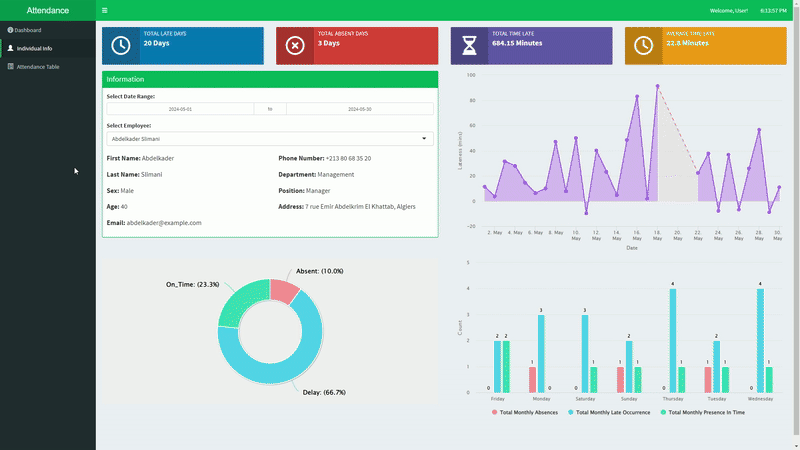

# Attendance System with Face Recognition and Data Analysis

## Overview
This project combines one-shot learning for face recognition with data analysis techniques to enhance attendance systems. The project consists of two main applications:
1. **Face Recognition and Attendance Data Gathering** - Implemented in Python.
2. **Attendance Data Dashboard** - Implemented in R.

## Table of Contents
- [Overview](#overview)
- [How It Works](#how-it-works)
  - [Face Recognition Application](#face-recognition-application)
  - [Attendance Data Dashboard](#attendance-data-dashboard)
- [Visual Demonstration](#Visual-Dimonstration)

## How It Works
### Face Recognition Application
The face recognition application uses one-shot learning to identify individuals and record their attendance. Here's a brief workflow:
1. **Capture Image**: The system captures an image of the individual.
2. **Preprocess Image**: The image is preprocessed to enhance recognition accuracy.
3. **One-Shot Learning**: The system uses a pre-trained model to recognize the face.
4. **Record Attendance**: The recognized individual's attendance is recorded in the database.

### Attendance Data Dashboard
The dashboard provides an analysis of the attendance data collected. Here’s a brief workflow:
1. **Data Import**: The system imports attendance data from the database.
2. **Data Processing**: The data is processed to extract meaningful insights.
3. **Visualization**: The processed data is visualized using interactive charts and graphs.

## Visual Dimonstration
### Registration

### Recognition & Attendnace tracking

### Dashboard 
#### Main Tab

#### Individual Info

#### Data Tab

